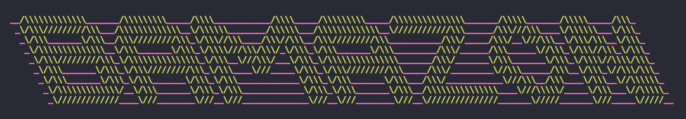

# Bamazon mySQL assignment

The goal of this assignment was to create a command-line storefront using the npm inquirer package and MySQL as the database. The app will take in orders from customers and deplete stock from the store's inventory. 

# Installation

### MySQL Database Setup
In order to run this application, you should have the MySQL database already set up on your machine. If you don't, visit the [MySQL installation page](https://dev.mysql.com/doc/refman/5.6/en/installing.html) to install the version you need for your operating system. Once you have MySQL isntalled, you will be able to create the Bamazon database and the products table with the SQL code found in Bamazon.sql. Run this code inside your MySQL client like Sequel Pro to populate the database, then you will be ready to proceed with running the Bamazon interface.

To run the application locally, first clone the repository
```javascript
git clone https://github.com/CavanWagg/Bamazon-Customer-View
```
Next, step into the project folder and install the dependencies
```javascript
cd Bamazon-Customer-View
npm install
```
Finally, run the server locally
```javascript
node Bamazon.js
```

**Click the image below for a video demonstration**

<a href="https://cl.ly/1w2D1J45193B"></a>
